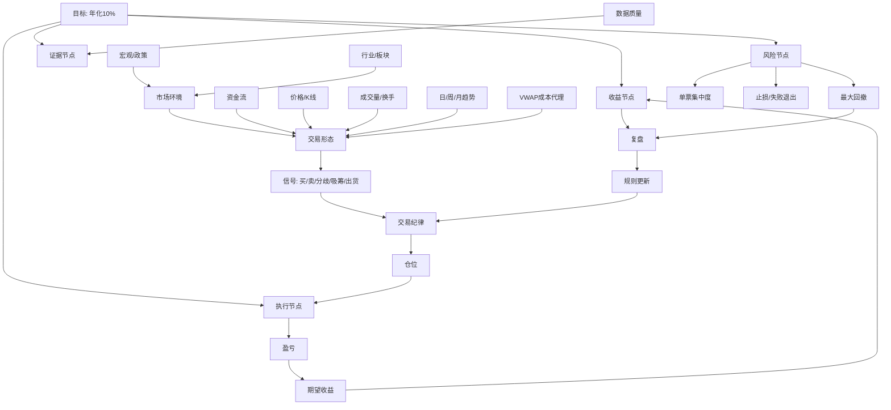

# 交易知识图谱和年化 10% 目标

目标：把“想跑到年化 10%”拆成可验证的交易系统，而不是靠单次预测。

边界：这是学习、监控、回放和模拟盘框架，不是实盘投资建议。程序中的“主力意图”“成本”“收益预估”都是代理指标。

## 总图谱



## 节点定义

| 节点 | 程序字段/模块 | 作用 | 当前要求 |
| --- | --- | --- | --- |
| 数据质量 | `fund_flows_count`, `bars_count`, `missing_fund_flow_dates` | 判断数据是否足够可信 | 资金流覆盖率最好大于 80% |
| 市场环境 | 后续接指数/行业强弱 | 判断是否顺风 | 不在弱市场里硬做突破 |
| 板块同步 | `SectorFundFlowSnapshot` | 判断个股是否有板块确认 | 个股和板块资金同向更可靠 |
| 资金流 | `FundFlowSnapshot` | 主力净流入、超大单、大单、小单 | 不能只看一天，要看 3/5/10 日 |
| 价格/K线 | `Bar`, `Quote` | 突破、失败突破、区间 | 突破后跌回要快速退出 |
| 成交量/换手 | `volume_ratio`, `turnover_rate` | 判断活跃和风险 | 过热高换手不追 |
| 趋势 | `daily_trend`, `weekly_trend`, `monthly_trend` | 多周期过滤 | 周线未确认时降低突破权重 |
| 成本代理 | `vwap_60`, `vwap_120` | 估计市场成交成本区 | 离 60 日 VWAP 过远不追 |
| 交易期望 | `ReturnEstimate` | 胜率、均盈亏、期望值 | 至少 30 笔闭合交易后再比较 |
| 年化目标 | `TargetReturnAssessment` | 跟 10% 年化比较 | 输出差距和阻塞节点 |

## 关系机制

年化 10% 不是一个单信号能决定的结果，它大致来自：

```text
账户收益 = 交易机会数量 × 单笔期望收益 × 平均仓位 × 执行质量 - 回撤损耗 - 交易成本
```

程序里对应：

- 交易机会数量：`closed_trades_per_year`
- 单笔期望收益：`expectancy_per_trade_pct`
- 平均仓位：`breakout_weight`, `accumulation_weight`
- 执行质量：T+1、100 股、跳空开盘、失败退出
- 回撤损耗：`max_drawdown`
- 数据误差：资金流缺失、接口降级、行情源不稳定

如果只做一只股票，想达到年化 10%，通常只有三条路：提高单笔期望收益、增加有效交易机会、提高仓位。第三条最危险。当前程序默认不靠盲目加仓追目标，而是先要求样本、数据和信号稳定。

## 当前 000620 结论

按当前程序，盈新发展 `000620` 近一年：

- 当前年化：约 `0.42%`
- 目标年化：`10.00%`
- 目标资金：约 `110107.69`
- 当前资金：`100420.00`
- 差额：约 `9687.69`
- 闭合交易：`1` 笔
- 资金流覆盖率：约 `48.8%`
- 结论：`not_enough_evidence_for_capital_allocation`

阻塞节点：

- 数据覆盖不足：历史资金流只有约一半交易日。
- 样本不足：只有 1 笔闭合交易。
- 交易频率不足：约 1 笔/年，不能支撑稳定年化目标。
- 最新状态偏弱：最新信号仍是卖出/突破失败。
- 单票集中：只做一只股票，验证目标时波动和偶然性太强。

通过节点：

- 回撤控制：当前最大回撤较低。
- 执行规则：没有模拟订单被拒绝。

## 程序命令

默认目标为年化 10%：

```powershell
python run.py analyze-stock 000620 --days 370 --initial-cash 100000
```

调整目标为年化 15%：

```powershell
python run.py analyze-stock 000620 --days 370 --initial-cash 100000 --target-annual-return 15
```

报告里的 `Target Return Knowledge Graph` 会输出目标年化、实际年化、目标期末资金、当前期末资金、差额，以及每个节点的 `pass` / `watch` / `block` 状态。

## 下一步规则方向

为了接近年化 10%，优先级不是加仓，而是补节点：

1. 补数据：降低资金流缺失，增加指数、行业、公告节点。
2. 补样本：从 1 只扩到 10-30 只观察股，累计 30 笔以上闭合交易。
3. 补市场过滤：指数趋势、板块资金、市场成交额。
4. 补风控：单笔亏损上限、连续失败暂停、跳空风险处理。
5. 补复盘：每次信号记录“为什么买、为什么卖、是否符合图谱”。

## 参考资料

- [Investor.gov Asset Allocation](https://www.investor.gov/introduction-investing/investing-basics/glossary/asset-allocation)
- [Investor.gov Diversification](https://www.investor.gov/introduction-investing/investing-basics/glossary/diversification)
- [StockCharts Wyckoff Method](https://chartschool.stockcharts.com/table-of-contents/market-analysis/wyckoff-analysis-articles/the-wyckoff-method-a-tutorial)
- [IBD CAN SLIM](https://www.investors.com/ibd-university/can-slim/)
